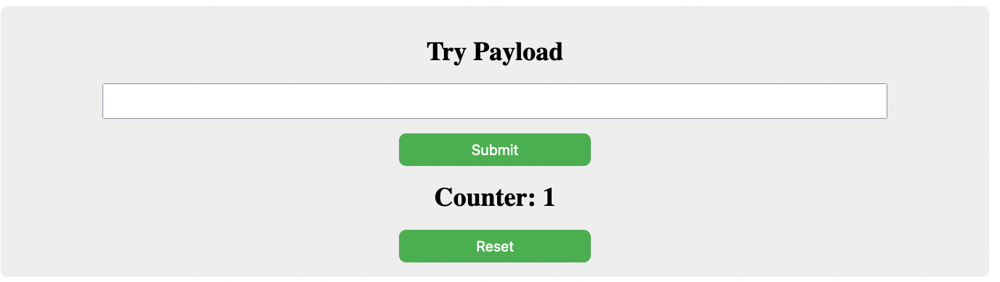
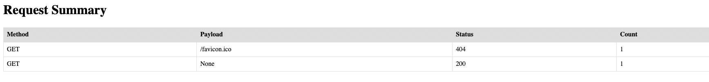

Simple flask http echo application can be used for evaluation/testing. 
 
Reset button to reset the data.

/info page displays the summarized http requests.

Installation Steps:

git clone <<repo>>
cd <<repo>>
docker compose up -d
